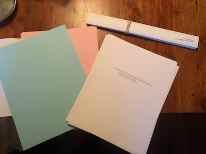

# Incertitude, exactitude, tests d'hypothèse

## Introduction

Ce matin, on fera un atelier sur les mesures avec les étudiants de BPH. Simon et moi nous sommes basés sur le vidéo suivant: https://www.youtube.com/watch?reload=9&v=9yUZTTLpDtk. En classe, nous aurons deux activités:

1. Essentiellement la même chose que le vidéo ci-haut: mesurer la surface de la feuille blanche croche pour discuter des "suppositions" souvent implicites.

2. Ensuite, répondre à la question : "Est-ce que la feuille rose est plus petite que la feuille bleue?", pour discuter de la comparaison de valeurs avec des incertitudes.

## Préparation

On prendra les règles [*Imperfecto*](http://www.kleinbottle.com/imperfecto) imprimées et coupées par mon assistante.  Ces règles ont plusieurs défauts:

1. Elles ont deux 17 cm,
2. Elles mesurent 30.5 cm,
3. Les divisions ne sont pas collées sur le bord de la règle.

Mais aussi deux règles *normales*.

Nous avons aussi préparé les feuilles blanches trouées et croches  (i.e. ne sont pas rectangulaires), en plus de deux piles de feuilles rectangulaires roses et bleues où les bleues ont été coupées de 2 mm sur la largeur et les roses de 4 mm  (avec une tranche).

## Résultats

1. Les étudiants mesurent les feuilles "croches".  On obtient les surfaces suivantes:
2. Les étudiants mesurent chacun leur feuille rose et bleue.  Ils arrivent grossièrement tous à 560 ± 2 cm^2^ et 564 ± 2 cm^2^ en prenant ± 0.5 mm.

## Discussion

Les étudiants finissent par comprendre que les feuilles ne sont pas rectangulaires.  On discute des suppositions implicites lorsqu'on mesure.

Certains étudiants ont enlevé la surface des trois trous, d'autres avaient des "vraies" règles, ce qui expliquent les trois groupes de mesures. On explique qu'on pourrait étalonner les règles *Imperfecto* avec les règles standards pour garder les données de tous.  On explique aussi qu'on devra s'entendre si on inclut les trous ou non, si on considère un seul côté de la feuille, etc...

Pour la partie avec les deux feuilles roses et bleues, ça se corsent.  À l'oeil, tout le monde voit que la rose est plus petite car on peut les mettre une par-dessus l'autre pour le constater.  Cependant, si on fait le calcul des surfaces avec incertitudes en considérant ± 0.5 mm, on arrive à 560 ± 2 cm^2^ et 564 ± 2 cm^2^.  

1. Plusieurs étudiants disent que les incertitudes se touchent, donc on ne peut rien conclure.  
2. D'autres disent qu'à l'oeil on le voit donc c'est correct
3. Une personne se dit qu'on pourrait mettre nos données ensemble pour voir.

La distribution de toutes les mesures de la classe est ci-dessous:

Une longue discussion s'ensuit où finalement on explique:

1. Nous pouvons rassembler nos données, mais cela supposent qu'elles sont toutes pareilles.
2. Le regroupement permet d'améliorer notre connaissance de la feuille rose moyenne et la feuille bleue moyenne. Nous disons maintenant qu'elles ont 560.5 cm^2^ ± 0.5 cm^2^ et 564.2 cm^2^ ± 0.4 cm^2^ car la connaissance de la moyenne est devenue $\Delta \mu = \sigma / \sqrt{n}$ 

Nous expliquons très rapidement que la meilleure méthode de comparer deux distributions est de prendre un tests d'hypothèse, et que dans ce cas particulier, nous aurions pu prendre le test Student dans MATLAB qui permet de tester l'hypothèse que les deux échantillons de mesures bleus et roses viennent ou non de la meme distribution. Dans notre cas, on montre que non, ils ne viennent pas de la meme distribution.

## Conclusion

Nous en sommes encore à évaluer l'experience.

## Annexe 1: Étalonnage de la règle Imperfecto

L'étalonnage de la règle *Imperfecto* obtenu à partir de la photo et d'une règle de reference est le suivant:

## Annexe 1: Mes donnnées, largeur feuille rose

J'ai mesuré la feuille rose: [20.55, 20.55, 20.52, 20.52, 20.55, 20.55, 20.56, 20.55, 20.53, 20.55, 20.57]

## Annexe 2: Tests d'hypothèse

Nous aurons besoin de parler de Tests d'Hypothèse, que je ne connais pas très bien.  J'ai donc trouvé le site suivant: https://onlinecourses.science.psu.edu/stat502/node/139/

On veut savoir si deux distributions sont identiques ou non.  La stratégie à suivre est d'émettre l'hypothèse qu'elles sont identiques, et de vérifier si cela est vrai.  On appelle cette hypothèse *l'hypothèse nulle* écrit $H_\circ$, car si elle est vraie, nous n'aurons rien appris de nouveau, au contraire si elle est fausse, nous aurons appris quelque chose. Nous avons les situations suivantes:

|               | En réalité, $H_0$ est vraie (distributions identiques)       | En réalité, $H_0$ est faux (distributions différentes)       |
| ------------- | ------------------------------------------------------------ | ------------------------------------------------------------ |
| Accepte $H_0$ | Ok                                                           | Erreur: Je dis que les distributions sont identiques mais elles sont différentes. |
| Rejette $H_0$ | Erreur: Je dis que les distributions sont différentes mais en fait, elles sont identiques. | Ok                                                           |

ou encore, de façon plus formelle:

|               | En réalité, $H_0$ est vraie            | En réalité, $H_0$ est faux             |
| ------------- | -------------------------------------- | -------------------------------------- |
| Accepte $H_0$ | Ok: Probabilité 1- $\alpha$            | Erreur de type II, probabilité $\beta$ |
| Rejette $H_0$ | Erreur de type I: probabilité $\alpha$ | Ok: Probabilité 1- $\beta$             |

