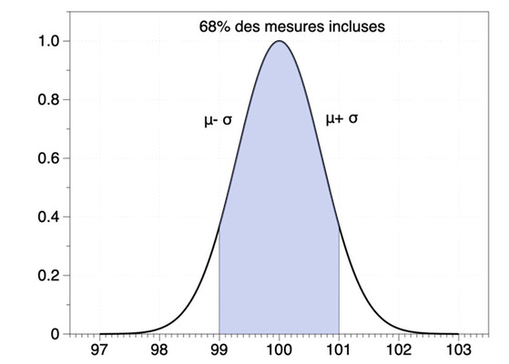
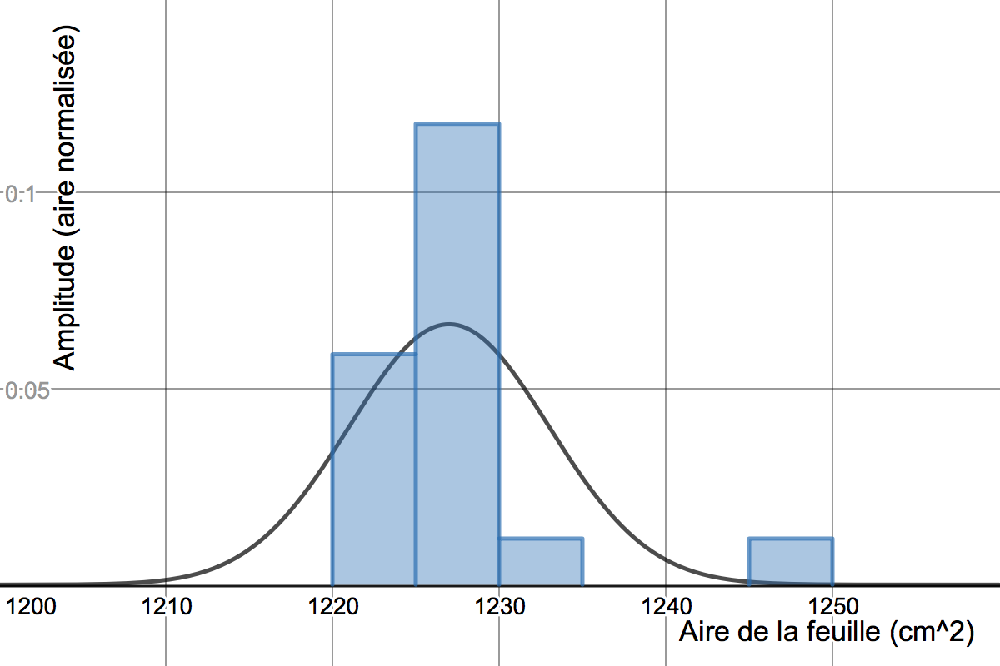
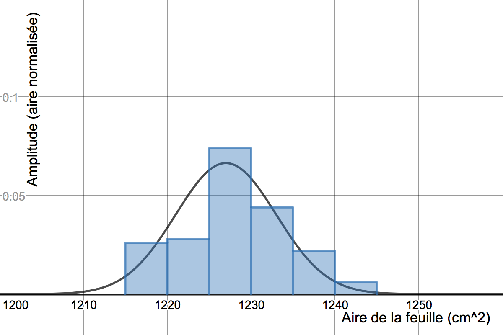
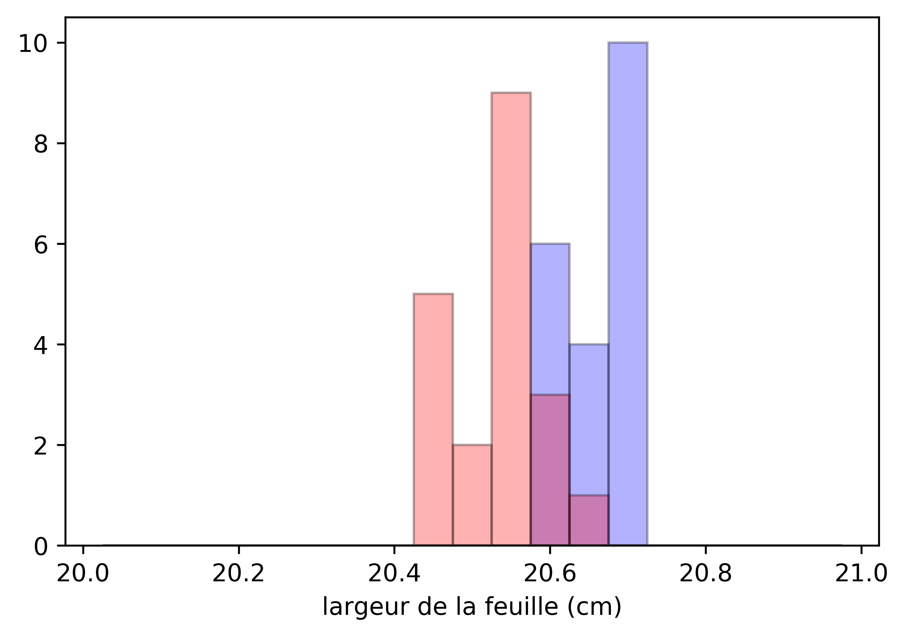

## Ateliers sur la mesure de l'aire d'une feuille 

30 septembre et 7 octobre 2019 - Daniel Côté et Simon Rainville


------

**POINTS ESSENTIELS** 

- Un résultat sous la forme *(mesure ± incertitude)* **représente une distribution**, qu'on suppose habituellement **gaussienne, ou normale**. L’ *incertitude* est la déviation standard 𝜎, une mesure de la largeur de la distribution. La *mesure* est la moyenne de la distribution, le sommet de la gaussienne, la valeur la plus probable.
- La moitié de la plus petite division est un ordre de grandeur raisonnable à utiliser pour l'incertitude en l'absence d'autres informations (mais le jugement de l'expérimentateur doit être pris en compte). Lorsque c’est possible, il est souhaitable de répéter la mesure (de manière indépendante mais dans les mêmes conditions). L'écart-type $\sigma$ des mesures obtenues nous renseigne alors sur la largeur de la distribution qui décrit les données. 
- **L’incertitude sur la valeur de la moyenne est donnée par** $\mathbf{\frac{\sigma}{\sqrt{N}}}$. C'est ainsi que notre estimation de la moyenne s'améliore en augmentant le nombre $N$ de mesures. 
- En science expérimentale, on cherche habituellement à tester une hypothèse par des mesures. On se retrouve alors souvent à comparer deux distributions, par exemple pour répondre à la question: "Est-ce que les feuilles bleues ont la même largeur que les feuilles roses ?". On utilise alors un **test de Student** dont le résultat nous indique la probabilité que les deux échantillons proviennent d'une seule et même population. 

------


#### Constats initiaux sur la prise de mesures

- Il faut définir précisément la question avant d'entreprendre une mesure (trous, 2 côtés, ...) 
- Il est inévitable de faire des suppositions mais on doit en être conscient et prendre l'habitude de les vérifier le plus possible. (Est-ce que la feuille est rectangulaire? Mesurer en haut et en bas.)
- Il faut être conscient des limites de nos instruments de mesure. Idéalement, on souhaiterait les valider en les comparant avec un autre instrument. (Par exemple, notre règle n'était psa fiable.) Si on dispose d'une référence fiable et précise, on peut étalonner notre instrument de mesure et ajuster les données en conséquence. Cela peut se faire après la prise de mesure.
- Nous supposons toujours que les erreurs sont normalement distribuées: les distributions sont donc normales (gaussiennes).


#### Première partie: signification de $\mathbf{a\pm\Delta a}$

Lorsqu'on affirme que la mesure de la largeur de la feuille est $100\pm1~$cm, quelle est la signification précise de ce résultat ?  **L'affirmation "La largeur de la feuille est de $100\pm1~$cm signifie que si on répètait la même mesure un grand nombre de fois *dans les mêmes conditions*, on obtiendrait une distribution gausienne centrée sur 100 cm et de largeur 1 cm.**  Cela implique par exemple que, statistiquement, 68% des valeurs mesurées devraient être entre 99 et 101 cm et que la valeur la plus probable est 100 cm.  Cette distribution est illustrée ci-dessous:




#### Deuxième partie: mesures répétées

À partir des différentes mesures des dimensions de la feuille, chaque personne a obtenu une estimation de l'aire de la feuille. (La propagation des incertitudes sur les mesures de longueur pour calculer l'incertitude sur l'aire fera l'objet de discussions ultérieures.) On peut représenter graphiquement les mesures obtenues à l'aide d'un histogramme. 




On constate que les valeurs, même si elles sont peu nombreuses, sont distribuées approximativement selon une gaussienne (courbe superposée sur l'histogramme). Pour estimer les paramètre de cette distribution, on calcule la moyenne $\mu$ et la déviation standard $\sigma$ de ces données et on obtient $S = \mu \pm \sigma = 1227,2\pm5,5\simeq 1227\pm6~\text{cm}^2$.

**Questions**:

- Quelle est maintenant notre meilleure estimation de l'aire de la feuille ? 
- Si on prenait plus de mesures, disons 100 plutôt que 17, est-ce qu'on connaîtrait l'aire plus précisément? Est-ce que cela influencerait la moyenne et/ou la déviation standard de la distribution?

En réalité, un plus grand échantillon (plus de mesures) ne change rien à la distribution. Sa largeur dépend uniquement du "bruit" dans nos mesures (lié à la méthode utilisée). La figure ci-dessous illustre un échantillon de 100 mesures de l'aire de la feuille. La distribution n'a pas changée mais notre connaissance de la distribution s'est améliorée. Il est donc maintenant possible d'estimer la valeur de la moyenne plus précisément. En effet, l'incertitude sur la moyenne est donnée par la déviation standard $\sigma$ divisée par $\sqrt{N}$, où $N$ est le nombre de mesures . Donc notre estimation de l'aire de la feuille est:

$\begin{equation} S = \mu \pm \frac{\sigma}{\sqrt{N}} = 1227 \pm \frac{5,5}{\sqrt{17}}= 1227,4 \pm 1,3 \simeq 1227 \pm 1 \;\text{cm}^2\end{equation} $

Avec les 100 mesures indépendantes montrés sur l'histogramme ci-dessous, la moyenne serait

$\begin{equation} S = \mu \pm \frac{\sigma}{\sqrt{N}} = 1228,2 \pm \frac{6,0}{\sqrt{100}}= 1228,2 \pm 0,6 \;\text{cm}^2\end{equation}$




#### Troisième partie: comparer des distributions

On cherche maintenant à déterminer si les feuilles roses ont la même largeur que les feuilles bleues. Considérons les deux séries de mesures représentées sur l'histogramme ci-dessous:



La question pourrait être reformulée comme "Est-ce que les moyennes de ces deux distributions sont égales ?" Utilisant ce que nous avons appris, on calcule ces moyennes: 

Moyenne des feuilles bleues: $\mu_b \pm \frac{\sigma_b}{\sqrt{N_b}} = 20,56 \pm \frac{0,06}{\sqrt{20}} = 20,56 \pm 0.01$ cm

Moyenne des feuilles roses:  $\mu_r \pm \frac{\sigma_r}{\sqrt{N_r}} = 20,68 \pm \frac{0,04}{\sqrt{20}} = 20,68 \pm 0,01$ cm

En premier lieu, on peut simplement se demander "Est-ce que les barres d'erreur se touchent ?" mais on peut aller plus loin et répondre quantitativement à la question "Quelle est la probabilité que ces deux distributions de mesures proviennent en fait de la même population ?" Autrement dit, si je supppose que les feuilles bleues et roses sont identiques (hypothèse nulle), quelle serait la probabilité d'obtenir les deux moyennes observées dans deux échantillons de mesures purement par hasard ? L'outil statistique pour répondre à cette question est un **test de Student**. 

En pratique, des fonctions existent pour effectuer un test de Student dans de nombreux environnements: par exemple la fonction *T.TEST* dans Excel,  *ttest* dans Matlab, *TTEST* dans Mathematica, *scipy.stats.ttest_ind* en Python, etc. Il est nécessaire de se renseigner pour bien comprendre la signification des paramètres de ces fonctions. En général, le résultat fournit directement la probabilité que les deux distributions proviennent d'une même population (p-value). On considère que si cette probabilité est inférieure à 0,05 ou 0,01 (5% ou 1%), alors on peut rejeter l'hypothèse nulle et conclure que la différence entre les deux distributions est statistiquement significative. 

Dans le cas spécifique illustré ci-dessus, le test dans Python retourne comme résultat ($b$ et $r$ sont les listes des valeurs pour les feuilles bleues et roses respectivement) : 

```python
>>> scipy.stats.ttest_ind(b, r)
Ttest_indResult(statistic=7.684227890383348, pvalue=2.975371339734147e-09)
```

Le premier chiffre du résultat est la statistique du test (t-statistics) tandis que le second est la **p-value**. Ici, la probabilité que les deux couleurs soient de même largeur est infime ($<3\times10^{-7}$ %). On peut donc conclure que nos mesures démontrent que les feuilles des deux couleurs viennent de distributions différentes.  On le savait déja en superposant une feuille rose et une bleue (puissance des mesures différentielles) mais ça ne sera pas toujours le cas... 