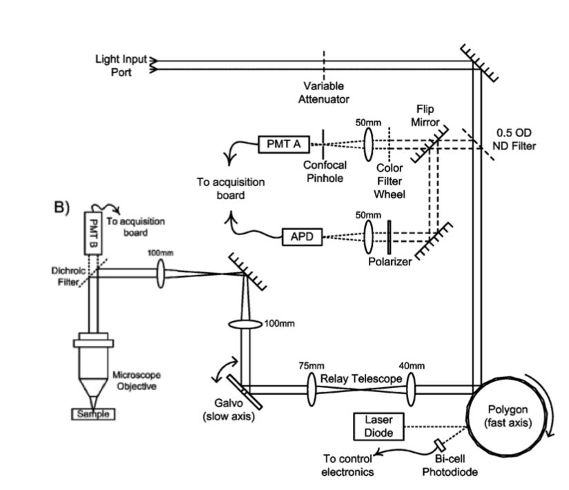

1. Un microscope à grand champ utilise une camera Orca Flash de Hamamatsu et un objectif Olympus 40x pour imager une mince couche de fluorophore (2 µm) fluoresceine de concentration inconnue. L'excitation se fait avec un laser 488 nm avec des filtres bleus. Lorsque vous sauvegardez l'image, vous obtenez des valeurs de 16-bit allant de  950 à 1050, avec une moyenne de 1000 lorsque vous intégrez 100 ms.  Quelle est la concentration de marqueurs fluorescents?

2. Le microscope à balayage (recopié ici bas) utilise un tube photomultiplicateur R3896 avec un socket C7950 en détection confocale pour imager du FITC. L'objectif 40x est utilisé correctement. Le sténopé (*pinhole*) devant la PMT A a un diamètre de 10 µm.  Quel est la concentration de FITC si vous mesurez ceci à l'oscilloscope en provenance d'un seul pixel en illuminant avec un laser bleu à 488nm:

   

   
