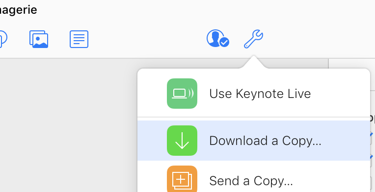

# COURS
## Contenu de ce répertoire

Ce répertoire GitHub contient mes notes de présentation en classe, des résumés, des liens vers les diapos originales. Pour l'instant, c'est minimal: seulement le cours *BPH-7006 Imagerie en biophotonique* est présent.

L'entente ici est que je rends mes notes complètement disponibles mais que vous **corrigerez** toute erreur qui s'y est glissée en me soumettant une correction (voir section Correction plus bas).

## Format de fichiers

Pour lire les notes de cours en format **Markdown (.md)**, il est fortement recommandé de télécharger le logiciel gratuit http://typora.io qui lit les fichiers Markdown mais supporte en plus les équations LaTeX, les tables des matières, et plein d'autre belles choses. Sinon, lisez les **PDFs** directement.

Pour obtenir les notes de cours, suivez directement le lien (.url sur votre ordinateur) pour aller vers la version Live du document. Vous pourrez télécharger dans le format de votre choix (Powerpoint, Keynote ou PDF):

## Comment me faire parvenir une correction?

1. Simple pour vous: Modifiez les textes directement et renvoyez moi le document modifié.
2. Simple pour moi: Faites une branche (*fork*) du répertoire, modifiez et soumettez votre correction à l'aide d'un *Pull Request*.

Daniel Côté

dccote@cervo.ulaval.ca

