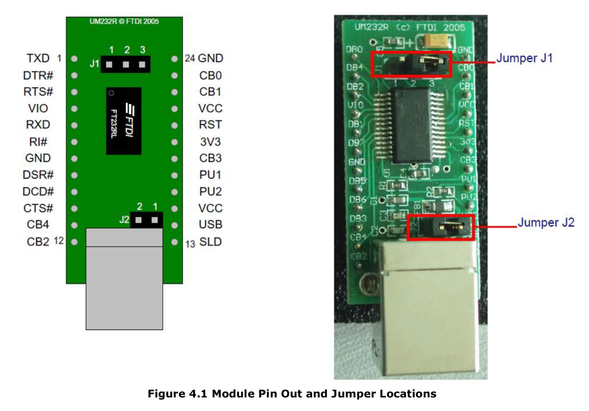

# DAQ: Entrées-sorties numériques avec le UM232R

## Le monde numérique

En classe comme dans la vie, la question la plus simple se répond par oui ou par non. La première tâche la plus simple que l'on peut faire avec un appareil d'acquisition ou de contrôle sera donc de lui faire dire Oui ou Non. On peut s'imaginer plusieurs interprétations de réponses binaire exclusives: vrai ou faux, 1 ou 0, "Je suis prêt" ou "Je ne suis pas prêt". 

Les pionniers de l'informatique ont dû concevoir un système qui permettrait de représenter les valeurs sans ambiguïtés pour les stocker et les manipuler avec un circuit logique.  Pour bien des raisons qui viennent à la fois de l'ingéniosité (il fallait y penser) et de l'opportunité technologique (le transistor semionducteur et son potentiel de fabrication et miniaturisation), il est devenu apparent qu'un système basé sur une représentation binaire des nombres et de leur transformation par des circuits logiques serait idéal.  Les premiers circuits électroniques de type TTL (ou *Transistor-Transistor-Logic*) dans les années 60 sont devenus les premiers circuits logiques, c'est-à-dire des circuits traitant des données d'entrée en représentation binaire pour produire de l'information à la sortie, aussi sous forme binaire. L'ensemble des circuits logiques permet d'implémenter toutes les opérations nécessaires à un calcul. Nous reviendrons plus tard au très passionnant côté *hardware* de la naissance de l'informatique, mais pour l'instant il suffira de savoir que la représentation réelle des nombres et des instructions dans les chips est sous forme binaire: une tension est à 5V est VRAI (ou 1) et une tension à 0V est FAUX (ou 0)[^1].

## Bits et octets

Un **bit** a 2 valeurs possibles, 0 ou 1. C'est la plus petite quantité d'information que nous puissions avoir sur quelque chose[^2].  Une collection ordonnée de 8 bits est un octet. Chaque bit pouvant avoir deux valeurs, un octet peut donc avoir  $2\times2\times2\times2\times2\times2\times2\times2=2^8 = 256$ valeurs différentes. Par commodité, nous représentons cela sous forme de nombre en base 2 (binaire). La séquence suivante de 8 bits 0 0 1 0 0 1 0 1 peut être prise pour avoir une valeur de:
$$
0 \times 2^7 + 0 \times 2^6 + 1 \times 2^5 + 0 \times 2^4 + 0 \times 2^3 + 1 \times 2^2 + 0 \times 2^1 + 1 \times 2^0 = 37\text{ dec}.
$$

Comprenons bien que l'interprétation d'un octet en nombre entier allant de 0 à 255 n'est rien de plus qu'une *interprétation*: on pourrait aussi interpréter ce nom autrement. Par exemple, on pourrait déterminer que si le dernier bit est 1.

Dans de nombreux textes, une valeur binaire est notée %00100101 (Python: `0b00100101`) pour la différencier de la valeur décimale 100101, qui a pour valeur «cent mille cent un». Cependant, la notation binaire n’est pas pratique: elle prend beaucoup de place lorsqu’elle est écrite et il est difficile d’évaluer rapidement une valeur pour le non-expert. Par conséquent, une notation raccourci est l'hexadécimale ou la notation en base 16. Les "chiffres" hexadécimaux sont {0, 1, 2, 3, 4, 5, 6, 7, 8, 9, A, B, C, D, E, F}.  Le nombre ci-dessus peut donc être ré-écrit sous la forme %10100101 = $10 \times 16^1 + 5 \times 16^0$ ou 0xA5 en hexadécimal, le préfixe 0x (souvent seulement x) désignant hexadécimal. Évidemment, puisque la base $16 = 2^4$on voit que la notation hexadécimale permet de regrouper les bits par groupe de 4: les moins significatifs (à droite) sont représentés par le chiffre 5 = %0101​ et les plus significatifs (à gauche) sont représentés par la lettre 0xA = %1010.

L'importance de la notation binaire vient du fait que tout langage de programmation que l'on utilisera pour communiquer avec notre appareil devra invariablement passer par des représentations en binaires et des octets, puisque c'est la représentation interne naturelle de l'ordinateur.

## Premier branchement

Pour commencer à faire un système simple avec lequel on pourra expérimenter, on utilise le module de communication **UM232R** de FTDI ([specifications](https://www.ftdichip.com/Support/Documents/DataSheets/Modules/DS_UM232R.pdf)). Ce module est très intéressant pour plusieurs raisons:

1. Il se branche simplement dans le port USB de n'importe quel ordinateur
2. Il ne demande aucun branchement supplémentaire pour être au moins fonctionnel
3. Il permet de construire un systeme pour communiquer avec d'autres appareils.  En fait, il permet de mettre à jour les vieux systèmes RS232 pour USB.
4. Les *drivers* (pilotes en français) de FTDI existent pour toutes les plateformes
5. Les puces USB de FTDI sont utilisées dans un très grand nombre d'appareils
6. Les librairies de FTDI sont disponibles, simples et sans bugs, et sont supportées par Python.

Pour commencer, il faut se procurer le fameux module UM232R.  La façon la plus simple, venez me voir à mon bureau POP-2141 et demandez-la moi, j'en ai quelques uns. Sinon, on peut les commander pour 28$ chez [Digi-Key](https://www.digikey.ca/product-detail/en/ftdi-future-technology-devices-international-ltd/UM232R/768-1019-ND/1836397) , numéro de pièce Digi-Key 768-1019-ND, ou FTDI UM232R. Idéalement, un petit [kit de breadboard](https://www.digikey.ca/product-detail/en/twin-industries/TW-E41-102B/438-1047-ND/643113) comme le 438-1047-ND serait acheté en même temps, mais n'importe quel breadboard fait l'affaire. On remarque:

1. Il y a 24 pins, on commence a compter en haut à gauche en tournant dans le sens trigonométrique.
2. Plusieurs pins sont identifiées RST, GND, VCC, VIO mais d'autres sont identifiées avec des termes génériques DB0, DB1, etc...
3. Le [manuel](https://www.ftdichip.com/Support/Documents/DataSheets/Modules/DS_UM232R.pdf) indique qu'il y a une pin nommée TXD (*transmission data*) et une nommée RXD (*receiving data*)
4. Il y a une pin RESET. Le [manuel](https://www.ftdichip.com/Support/Documents/DataSheets/Modules/DS_UM232R.pdf) indique clairement que mettre cette pin à 0V forcera un "reset" de la puce.
5. Il y a deux pins configurées par défaut `CB0` et `CB1` pour servir d'indicateurs de transmission et de réception avec une DEL.
6. Un groupe de pins est identifiés comme faisant du *hardware handshake*: DTR, RTS, DSR, DTS
7. Bien que nous soyions en 2018, il reste des pins identifiées comme: Ring Indicator (RI, pin 6) Data Carrier Detect Control Input (DCDC, ligne de tonalité d'un modem)



Pour l'instant, mes instructions seront pour macOS car c'est ce que j'utilise. D'autres instructions devraient suivre pour les autres plateformes, même si la tâche me donne plutôt le goût d'aller chez le dentiste me faire enlever la totalité des dents d'en bas sans anesthésie.

### Expérience 1: brancher

Si vous branchez un câble USB dans le module, la magie du standard USB[^4] devrait faire son oeuvre si le driver FTDI est installé (souvent standard, sinon [obtenez et installez-le](https://www.ftdichip.com/Drivers/VCP.htm)).  Votre "puce" apparaîtra comme un port série ou *Virtual Comm Port* (VCP). Les systèmes qui utilisent le standard POSIX (macOS[^3] et Linux) le montreront dans  `/dev/`:

```bash
Nestor:anaconda2 dccote$ ls -l /dev/*usbserial*
crw-rw-rw-  1 root  wheel   18,  51 14 Oct 22:42 /dev/cu.usbserial-FTCBGW24
crw-rw-rw-  1 root  wheel   18,  50 14 Oct 22:42 /dev/tty.usbserial-FTCBGW24
Nestor:anaconda2 dccote$
```

Le port série en POSIX apparait en deux formes pour des raisons historiques: `cu` (callout) et `tty` ([teletype](https://en.wikipedia.org/wiki/Teleprinter)).  Nous prendrons `cu*` pour la communication avec les appareils. Le nom du port série (ici `cu.usbserial-FTCBGW24` est programmé par FTDI directement dans la puce à la fabrication).  La valeur `FTCBGW24` est un numéro de série unique chaque puce, donc la vôtre sera différente.

### Expérience 2: débrancher

Si on débranche le câble USB, le port de communication associé au module disparaitra du système car le module n'est plus disponible. On peut faire la même chose à l'aide d'un fil en connectant la pin `RST` au `GND` pour forcer un reset du module. Lorsqu'on le fait, on voit:

```bash
Nestor:anaconda2 dccote$ ls -l /dev/*usbserial*
ls: /dev/*FT*: No such file or directory
Nestor:anaconda2 dccote$
```

Avant de continuer, on enlève la connexion entre  `RST` et `GND` .

### Expérience 3: parler

Le langage de référence dans ces tutoriels est Python, non pas pour sa puissance, sa convivialité ou l'élégance de sa syntaxe mais bien pour son universalité. La façon la plus rapide d'être opérationnel est de télécharger [Anaconda2](https://www.anaconda.com/download/). Vous aurez un environnement et la majorité des modules importants pour travailler, incluant un petit module appelé `libftdi`. Surprenamment, les routines de port serie `PySerial` n'y sont pas, on les installe avec: `easy_install PySerial`. Par la suite, le programme suivant peut être exécuter:

```python
import serial

text = 'hello'
path = '/dev/cu.usbserial-FTCBGW24'
try:
    port = serial.Serial(path)
    bytesWritten = port.write(text)

    if bytesWritten == len(text):
        print('Wrote to port: %s' % port.name)
    else:
        print('Error when writing to port: %s' % port.name)

    port.close()
except IOError:
    print('Unable to open the port with path: %s' % path)
except:
    print('Unknown error')

```

On peut regarder plusieurs choses:

1. Si on connecte une DEL à la pin CB1, elle clignotera lorsqu'on envoie des données
2. Si on utilise un oscilloscope sur la pin TXD, on verra la ligne osciller entre 0V et 5V.

Rien n'est connecté, donc notre module "parle dans le vide". On vient de dire au module d'envoyer "hello" sur "ses pins de sortie" mais cette information n'a pas été utilisée ou capté par personne, sauf notre oscilloscope.

### Expérience 4: écouter

Si on essaie de lire le module, on n'obtiendra rien: la ligne read() ne completera jamais (il n''y a pas de délai limité):

```python
import serial

text = 'hello'
path = '/dev/cu.usbserial-FTCBGW24'
try:
    port = serial.Serial(path)
    bytesRead = port.read(text)

    if bytesRead == len(text):
        print('Wrote to port: %s' % port.name)
    else:
        print('Error when writing to port: %s' % port.name)

    port.close()
except IOError:
    print('Unable to open the port with path: %s' % path)
except:
    print('Unknown error')
```


### Expérience 5: écouter l'écho

On peut par contre prendre le module et le connecter pour qu'il s'écoute lui-même.  En effet, on connecte la pin de sortie (TXD) à la pin d'entrée (RXD).  Ainsi, 

```python
import serial

text = 'hello'
path = '/dev/cu.usbserial-FTCBGW24'
try:
    port = serial.Serial(path)
    bytesWritten = port.write(text)

    if bytesWritten == len(text):
        print('Wrote to port: %s' % port.name)
    else:
        print('Error when writing to port: %s' % port.name)

    echo = port.read(bytesWritten)

    if bytesWritten == len(echo):
        print('Read from port: %s' % port.name)
    else:
        print('Error when reading to port: %s' % port.name)

    port.close()
except IOError:
    print('Unable to open the port with path: %s' % path)
except:
    print('Unknown error')
```


[^1]: En fait, le standard TTL demande une tension supérieure à 2V pour être considéré comme un logique VRAI et moins de 0.8V pour un logique FAUX. 
[^2]: Bien qu’il soit omniprésent en informatique, le terme «bit» a été inventé par Claude Shannon, père de la théorie de l’information.
[^3]: Apple fournit depuis macOS 10 un driver FTDI avec le système, mais celui-ci n'est pas directement de FTDI mais bien d'Apple.  On peut tout de même installer le driver de FTDI. Cependant, depuis macOS 10, qui resserre la sécurité, le driver doit obtenir la permission de l'Administrateur pour pouvoir s'executer.
[^4]: Le standard USB est un standard complexe qui n'est pas nécessaire de comprendre pour l'instant.  Cependant, un bon ingénieur devra comprendre la reconnaissance des appareils, l'association des drivers, les classes, les vendor ID, product ID, la sérialisation des ports, les endpoints, etc... Bien sur, nous verrons tout cela plus loin lorsque ce sera nécessaire.


## Exercices

1. Écrivez la valeur suivante en binaire, décimal et hexadécimal:
   a. 12
   b. 0x45
   c. %1001101
   d. 230
   e. 0xF3
2. Effectuez les opérations suivantes:
     a. % 00101101 +% 00100001
     b. 0xF6 - 0x41
     c. 0x29 - 0x56
3. Multipliez %00111001 par 2, 4 et 8 et écrivez les réponses en binaire.
4. Divisez %00111001 par 2 et écrivez la réponse en binaire.
5. Multipliez 0xF3 par 16.


​    

## Plan potentiel

1. Entrées-sorties numériques simples
   1. Faire un circuit simple pour obtenir des entrées sortie avec UM232R
   2. Installer python in libftdi avec Anaconda
   3. Vérifier avec un oscilloscope l'état des *pins*
   4. Allumer une DEL
   5. Faire clignoter une DEL
2. La communication par RS-232
   1. Qu'est-ce qu'un protocole?
   2. Pourquoi RS-232?
   3. Pourquoi USB?
   4. Faire un ECHO RS232