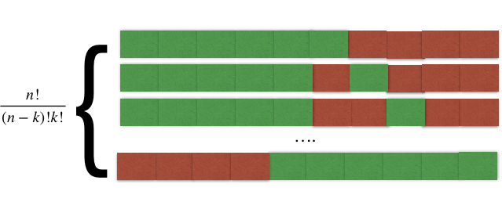

# Distribution de Poisson

## Introduction

J'ai obtenu la preuve [ici](https://medium.com/@andrew.chamberlain/deriving-the-poisson-distribution-from-the-binomial-distribution-840cc1668239).

Supposons qu'un événement aléatoire à une probabilité $p$ d'arriver dans un intervalle de temps $\Delta t$. Évidemment, il ya donc une probabilité $q = 1-p$ ne ne pas se produire dans le même intervalle. Par exemple, on peut avoir dans un intervalle $n \Delta t$ la situation suivante:

où vert est un événement positif et rouge un événément nul. La probabilité **exacte** que cet séquence spécifique arrive est simplement $P = p q p q q p p q p p = p^{6}q^{4}$ avec $n=10$. Si on veut la probabilité d'obtenir $k=6$ événements positifs dans un intervalle de $n=10$, on doit considérer toutes les permutations possibles:

On reconnait qu'il y a $\frac{n!}{(n-k)!k!}$ combinaisons non-ordonnées d'un groupe de $n$ blocs dont $k$ sont identiques ou $C^k_n$, donc la probabilité d'obtenir $k$ événement en $n$ période ayant une probabilité $p$ d'arriver est:

$$
P(k,n) = \frac{n!}{(n-k)!k!} p^k q^{n-k}
$$
Simplifions cette expression en utilisant: $\lambda = n p$.
$$
P(k,n) = \frac{n!}{(n-k)!k!} \left(\frac{\lambda}{n}\right)^k \left(1-\frac{\lambda}{n}\right)^{n-k}
$$

$$
P(k,n) = \left( \frac{\lambda^k}{k!} \right) \frac{n!}{(n-k)!} \left(\frac{1}{n^k}\right) \left(1-\frac{\lambda}{n}\right)^{n}\left(1-\frac{\lambda}{n}\right)^{-k}
$$

