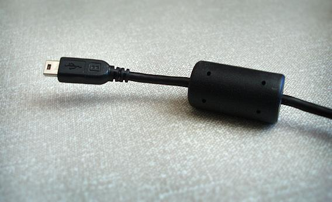
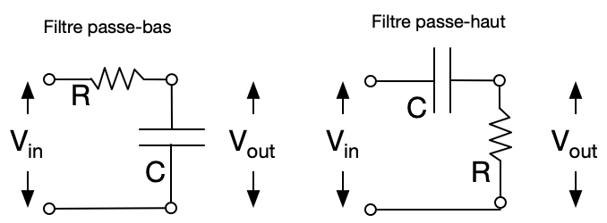
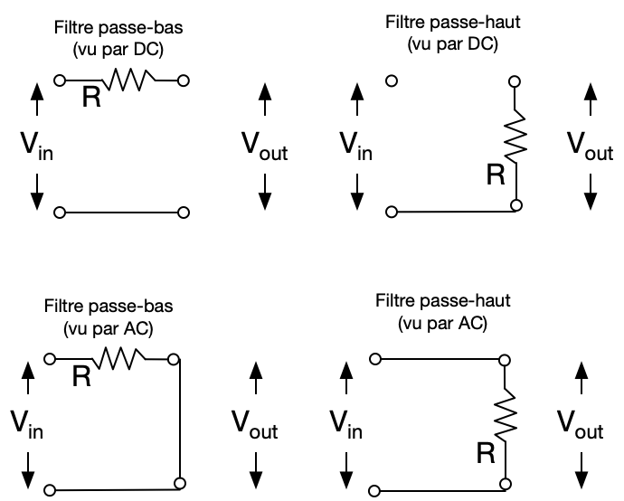

# Les bases de l'électronique

Une version PDF de ce document [existe](https://github.com/dccote/Enseignement/blob/master/HOWTO/HOWTO-Electronique.pdf).

Une version Markdown peut être lu avec les équations avec le logiciel gratuit [Typora](http://typora.io).

[TOC]

## Prélude

On ne s'en sort pas: la connaissance de l'électronique est essentielle pour accomplir les moindre tâches en optique: photodétection, numérisation, contrôle d'appareils, interface microprocesseur, gestion USB, etc... Il y a deux façons d'aborder ce domaine: 1) en devenant opérationnel ou 2) en comprenant[^1]. S'il y avait un seul conseil que je donnerais: les circuits, aussi complexes soient-ils, se séparent toujours en petits blocs fonctionnels. Savoir reconnaître les blocs représente 90% de la bataille.  J'espère avec ce document faire le premier aspect (vous rendre opérationnel) et avec un peu de chance, le deuxième (vous aider à comprendre).

La meilleure façon d'apprendre l'électronique, c'est d'en faire, d'être mauvais, et de s'améliorer. Pour citer Dave Grohl, c'est comme la musique :

> “When I think about kids watching a TV show like American Idol or The Voice, then they think, ‘Oh, OK, that’s how you become a musician, you stand in line for eight [...] hours with 800 people at a convention center and… then you sing your heart out for someone and then they tell you it’s not [...] good enough.’ Can you imagine?” he implores. “It’s destroying the next generation of musicians! Musicians should go to a yard sale and buy and old [...] drum set and get in their garage and just suck. And get their friends to come in and they’ll suck, too. And then they’ll [...] start playing and they’ll have the best time they’ve ever had in their lives and then all of a sudden they’ll become Nirvana. Because that’s exactly what happened with Nirvana. Just a bunch of guys that had some shitty old instruments and they got together and started playing some noisy-ass shit, and they became the biggest band in the world. That can happen again! You don’t need a [...] computer or the internet or The Voice or American Idol.” - Dave Grohl

Donc pour apprendre, il faut en faire. Il faut lire, bien sur, mais il faut en faire. Expérimenter peut se faire pour apprendre de façon intelligente:

1. Briser un fil, brûler une résistance, écraser un condensateur, brancher un transistor à l'envers, péter un chip à 10$ fait partie de l'apprentissage. Ce n'est pas grave: c'est quelques dollars. Voir 2.
2. Brancher 100V dans un oscilloscope de 3000$ et le péter, mettre ses mains ou sa langue sur 1200V et finir à l'hôpital, brûler une puce à 200\$ qui a un temps de livraison de 8 semaines, faire sauter le microntrolleur d'un laser commercial, fait partie de la liste des choses qui font que les gens se font mettre dehors.  Apprenez la différence avec 1.

Bon apprentissage.

## Les bases

1. Une source de tension idéale donne une différence de potentiel constante entre ses bornes, quelle que soit la résistance connectée entre ses bornes.
2. Une source de courant idéale donne un courant constant quelle que soit la résistance connectée entre ses bornes.
3. Un voltmètre idéal a une résistance "infinie" et mesure la différence de potentiel entre ses bornes sans prendre de courant.
4. Un ampèremètre idéal a une résistance nulle et mesure le courant qui passe entre ses bornes sans perte de potentiel.

## Commentaires généraux

1. La perte de tension à travers une résistance est donnée par le courant qui passe à travers multiplié par la résistance $V = RI$
2. Le courant qui passe dans un circuit est donné par la tension aux bornes de ce circuit divisée par la résistance totale du circuit $I = {V}/{R_t}$
3. La puissance dissipée par un élément est $P = VI $
4. **On mesure des tensions, en Volts**. La raison pourquoi on travaille en tension plutôt qu'en courant est qu'une mesure en parallèle d'une tension n'affecte pas le système et est égale à la mesure qui nous intéresse. Si on mesurait des courants, on devrait faire un calcul pour obtenir le courant du système à partir de notre mesure (car les courants se séparent selon les résistances) et si on le mesurait en série on devrait s'inclure dans le circuit.  Les deux options ne sont pas très pratique.
5. Si on retourne vraiment à la base de l'électromagnétisme, une différence de potentiel entre deux points (i.e. un gradient) nous dit qu'il y a un champ électrique entre ces deux points ($\nabla V \propto E$). Donc lorsque je mets une différence de potentiel entre deux points, les charges sont accélérées (i.e. il y a du courant).
6. Les résistances, capacitances et inductances sont regroupés sous le terme général *impédance*, qui est une résistance complexe.
7. Finalement, on décrira souvent les courants et les tensions en termes de fréquences d'oscillation.  On parle de DC pour les fréquences 0 Hz et AC pour les autres.
   1. Ne pas confondre la *fréquence* $f$ et la *fréquence radiale*  $\omega = 2\pi f$.  Personne n'utilise la fréquence radiale: on parle toujours en fréquence $f$.
8. Ainsi, puisque les circuits sont assez souvent linéaires, on décomposera en fréquences le courant et les tensions, et c'est pour ça que les impédances imaginaires et réelles (ci-dessous) deviennent utiles

## Règles (très) générales

- **Tension**
  1. Une tension moyenne dans un circuit simple est de l'ordre du Volt.
  2. Voltage est un anglicisme, même si tout le monde le dit. Même moi.
  3. Une tension d'alimentation dans un circuit analogique est typiquement ±12V ou ±15V
  4. Un circuit logique de type TTL (i.e. *Transistor-To-Transistor-Logic*) fonctionne avec 0 V et 5 V comme signaux.
  5. Mesurer 1 Volt est facile.  Mesure 1 mV est difficile. Mesure 10 V est très facile.
  6. Un bruit typique dans les circuits de Monsieur-tout-monde est de l'ordre de quelques mVs.
  7. 1 électron qui est accéléré par 1 volt aura une énergie de 1 eV (l'électron-volt) à la fin.  Oui, c'est de là que ça vient et c'est pratique.
     1. 1 eV est $1.6 \times 10^{-19} J$
- **Courant**
  1. Un courant moyen est de l'ordre de 10 à 100 µA
  2. Un très petit courant est en pA.
  3. Un courant très important est 1A

- **Résistance**
  1. Une résistance ralentit les électrons et dissipe l'énergie que les électrons obtiennent de la tension.
  2. Une résistance moyenne est de 10 kΩ.
  3. Une petite résistance résiduelle est de l'ordre de 1 à 10 Ω ou moins
  4. Une grande résistance d'entrée est de l'ordre de 1 à 10 MΩ.
  5. L'impédance d'une résistance est simplement $R$
  6. On parle de **résistance de charge** pour désigner toute résistance à travers laquelle une source se décharge. Il s'agit d'un terme vraiment général.  On va dire: "*La charge pour la source de tension est de 50Ω*".
  7. Les résistances en série s'additionnent pour donner la résistance totale $R_t = R_1 + R_2$
  8. En parallèle, on additionnent les inverses $R_t^{-1} = R_1^{-1} + R_2^{-1}$. Si ça vous surprend, c'est très simple: l'inverse de la résistance s'appelle la conductance.  Si j'ai deux "conduits" en parallèle, la "conductance" totale est la somme des deux, comme avec des tuyaux d'eau.
- **Condensateur** (ou capaciteur)
  1. Un condensateur est un réservoir qui peut accumuler des charges. 
  2. On mesure sa valeur (capacitance) en Farads. Une capacitance moyenne est environ 1 µF
  3. Une condensateur ne laisse pas passer le courant continu. Son impédance diminue avec l'augmentation de la fréquence d'oscillation du courant ou de la tension.
  4. L'impédance d'un condensateur est $\frac{1}{j 2\pi f C}$. On voit que si $f=0$, alors l'impédance est infinie: le courant continue ne passe pas dans un condensateur.
  5. Les capacitances résiduelles de connecteurs sont de l'ordre de quelques pF.
  6. Un câble "standard" a une capacitance de 30 pF/m
- **Inductance**
  1. On travaille très peu avec les inductances. Peu de circuits utilisent les inductances, sauf les transformateurs.
  2. Une inductance s'oppose au courant qui varie vite, et pas du tout au courant qui n'oscille pas. Son impédance augmente avec l'augmentation de la fréquence d'oscillation du courant ou de la tension.
  3. L'impédance d'une inductance est $j 2 \pi f L$.  On voit que si $f=\infty$, alors l'impédance est infinie: le courrant AC à haute fréquence ne passe pas dans un inducteur.
- **Batterie**
  1. Une batterie de maison AA contient une charge de 2000 mA-h (milli-ampère $\times$ heure), c'est-à-dire qu'elle peut fournir 2000 mA pendant une heure, ou 100 mA pendant 20 heures. 

## Les composantes
### Les résistances

À la base de plusieurs circuits, il y a les résistances.

1. Elles ont des **valeurs standards** qui semblent bizarres (10, 12, 15, ... 82, etc...), mais il y a une raison: les valeurs par décade (entre 10 et 100, entre 100 et 1000, etc...) sont séparées de façon égales sur une échelle logarithmique, et toute combinaison de 2 résistances peut être à moins de 10% de n'importe quelle valeur désirée. Il existe plusieurs groupes: E12, E24, E48, E96 et E192 qui respectivement permettent une précision de 10% , 5%, 2%, 1% et 0.5%. De plus, il y a des valeurs standards de 10$\Omega$, 100$\Omega$, 1k$\Omega$, 10k$\Omega$, 100k$\Omega$ et 1M$\Omega$ parce que des fois, dans la vie, on aime les chiffres ronds.
2. Elles peuvent être faites pour **dissiper la puissance** un peu, moyen, beaucoup, ou énormément. Les plus fréquentes en laboratoires sont de 0.5W.  Plus elles sont grosses, plus elles dissipent beaucoup de puissance. 1W c'est quand même beaucoup: cela permet de chauffer votre doigt de 1° en 1 seconde.  Si vous mettez votre doigt sur une resistance, ça risque d'être chaud.
   
3. Il existe des résistances variables appelées *potentiomètres*. Certains peuvent se mettre directement sur un *breadboard* (souvent ils sont bleus), d'autres se mettent sur des panneaux de contrôles et ils ont un bouton gradateur. Avec un bouton ou avec un tournevis, on ajuste la valeur de la résistance.
    
4. Les résistances sont simplement des mauvais conducteurs, avec des obstacles en différentes concentrations pour obtenir une résistance désirée.  Ainsi,  au niveau microscopique, les charges accélèrent jusqu'à ce qu'elles entre en collision, recommencent à accélérer, etc... Au niveau macroscopique (i.e. intégré sur un temps de µs par exemple), elles semblent avoir une vitesse moyenne constante.

### Les condensateurs

1. Les condensateurs souvent souvent utilisés car ils accumulent des charges: ils servent dans les filtres passifs et aussi comme réservoirs de charges près des puces. Quand on voit un condensateur dans un circuit on pense "ralentir, basses fréquences, accumulation de charge". On ne pense pas à "vitesse, hautes fréquences".
2. Les condensateurs ont une **capacitance** donnée. Ils viennent aussi en valeurs standards comme les résistances. Plus un condensateur est gros, plus il a une capacitance élevée.
   
3. Les condensateurs ont une **tension maximale** qu'ils peuvent accepter à leur bornes. 16V, 35V, etc...
4. Les condensateurs cylindriques ont souvent une **polarité**: on doit brancher le côté positif sur le potentiel plus élevé.  Les condensateurs de type *pastilles* n'ont pas de polarité.  
5. Si un condensateur brûle, on le change. Souvent, c'est visible car on voit l'électrolyte (espèce de caramel brun) sur le dessus ou il a simplement l'air brûlé. Si ça vient juste d'arriver, ça sent encore le brulé. Ça coûte 10¢. On le change pour un condensateur de même valeur.

### Les inductances

Le petit aimant enroulé autour des câbles de télé, USB ou autre, joue le rôle d'une inductance pour empêcher les très hautes fréquences de passer dans le fil (souvent du bruit ou dans le cas des télés, un "power surge" après une panne de courant qui peut briser la télé).

Sinon, j'ai utilisé une inductance une fois dans un circuit.  Je ne me rappelle plus ce que j'ai fait. Je pense que c'était au siècle précédent. Les inductances, ça ne sert pas vraiment.

## Les sources

### Les sources et appareils réels

Les appareils réels ont des impédances internes qui ne sont pas nulles, ni infinies.  **C'est très important pour les sources de tension et de courant**: on doit souvent savoir. C'est d'importance mineure pour les voltmètres et les ampèremètres car c'est suffisamment "assez petit" ou "assez gros".

* Il n'y a pas vraiment de règles pour les résistances internes des sources: quand on s'en préoccupe, il faut la mesurer (ou lire les spécifications).
* Un voltmètre a une résistance typiquement de 1M$\Omega$ ou 10M$\Omega$. Un voltmètre est utilisée **très souvent** parce qu'on le met en paralleèle dans le circuit, donc c'est facile. Un oscilloscope est un voltmètre résolu dans le temps.
* Un ampèremètre a une résistance typiquement de moins de 100$\Omega$, mais j'ai déjà vu 1k$\Omega$. On utilise **rarement** un ampèremètre en passant parce qu'on doit le mettre en série dans le circuit pour l'utiliser, et c'est souvent impossible. À la place, on met un voltmètre en parallèle sur une résistance connue, et on fait le caclul savant: $I = V/R$ pour avoir le courant.

Source de tension réelle: pour avoir la résistance interne d'une source de tension, c'est très simple:
1. On mesure la tension avec un voltmètre dans le **circuit ouvert**, c'est-à-dire sans courant, en connectant directement le voltmètre aux bornes de la source.  Puisque le voltmètre a une résistance très élevée, il n'y a pas de courant et donc aucune perte de potentiel à travers la résistance interne, et on mesure directement $V_s$.
2. Ensuite, on **ferme le circuit** avec une *résistance de charge* $R_c$ (pour que du courant passe) qu'on espère être proche de la résistance interne. On mesure la tension aux bornes de la résistance de charge. On l'appelera $V_c$, pour "tension aux bornes de la résistance de charge".  La tension mesurée $V_c$ sera plus faible que la tension $V_s$ car la résistance interne sera responsable d'une baisse de tension égale à $V_i = R_i I$ puisque maintenant, il y a du courant qui passe dans le circuit, contrairement à (1) où il n'y en avait pas.
3. Puisque l'on sait $V_c$ et $R_c$, on peut calculer **le courant** qui passe dans la résistance de charge, et donc dans le circuit, avec $I= V_c/R_c$.
4. Puisque la tension appliquée est $V_s$, et qu'une perte de tension de $V_c$ est mesurée à travers la résistance, on sait que la **perte de tension** dans la résistance interne est $V_i = V_s - V_c$ car la boucle doit passer de $V_c$ à 0V.
5. On sait la perte de tension dans la résistance interne et on sait le courant, donc la résistance interne est simplement $R_i = R_c(V_s - V_c)/V_c$.
   1. Si la résistance de charge qu'on a prise est beaucoup plus grande que la résistance interne, alors $V_s \approx V_c$ et ce sera difficile d'obtenir une valeur raisonnable car on aura $\approx 0/V_c$. On essaie d'avoir une résistance environ égale à ce qu'on attend.  On commence d'habitude avec une valeur plus grande que faible pour éviter de demander trop de courant (i.e. faire un court-circuit) et sauter le fusible de l'appareil. Un fusible coute 10¢: ce n'est pas grave, mais c'est plate.

### Les équivalences

Donc il y a des sources de *courants* et des sources de *tension*.  Vous vous demandez sûrement: "Oui mais ce qui sort d'une batterie, c'est un courant **ET** une tension!  Qu'est-ce que je suis supposé(e) dire: c'est une source de courant ou de tension!? Je peux passer de tension à courant ou courant à tension comme je veux! Donc, c'est quoi?".

La différence est extrêment simple: une source de puissance (i.e. un bloc d'alimentation) avec un résistance interne très faible se comportera comme une source de tension parce que toute résistance de charge connectée sera dominante par rapport à la résistance interne, et la perte de tension aux bornes de la résistance de charge sera la tension de la source (et sera donc toujours la même). Au contraire, une source avec un résistance interne très élevée se comportera comme une source de courant car la résistance de charge sera négligeable par rapport à la résistance interne et le courant sera dicté par la résistance interne (et sera donc toutjours le même).

On peut prendre un circuit d'une source de tension avec une résistance et la changer en circuit avec une source de courant équivalente, ce qui s'appelle l'équivalent de Norton:

$R_\text{Th} = R_\text{No}$

$V_\text{Th} = I_\text{No} R_\text{No}$

$I_\text{No} = \frac{V_\text{Th}}{R_\text{Th}}$

## Les circuits

### Les filtres passifs

Un filtre $RC$ est un filtre passif (i.e., il n'y a pas de batterie) qui permet de filtrer soit les hautes fréquences ou les basses fréquences. Un filtre RC a un temps caractéristique de $\tau = RC$ en  secondes.  On peut dire que la fréquence de coupure où l'atténuation est de 50% est $f_c = \frac{1}{2\pi RC}$. 

On peut visualiser les filtres pour les basses (DC) et hautes (AC) fréquences pour voir le fonctionnement. Les basses fréquences ne passent pas dans un capaciteur (le circuit est ouvert), et les hautes fréquences voient un fil conducteur (le circuit est fermé):

## Équipement

| Description                                           |                          Apparence                           |
| ----------------------------------------------------- | :----------------------------------------------------------: |
| Multimètre                                            |  |
| Câbles BNC ou coaxial                                 |  |
| Prises alligators                                     |  |
| Prises bananes                                        |  |
| Résistances pour différentes dissipation de puissance |  |
| Condensateurs                                         |  |

## TODO: Reste à faire

1. Voltage divider
2. Op-amp follower/buffer
4. Op-amp gain
5. Op-amp adder
6. Op-amp transimpedance
7. Numériseur
8. Instrumentation amplifier
9. https://artofelectronics.net

[^1]: J'étais nul en électronique au bacc. Nul. Zéro.  J'ai eu un déclic dans le cours Physique Expérimentale III en 1994 avec [Normand Balaux](https://www.coopfuneraire2rives.com/avis-de-deces/normand-balaux-147920/#ecrire) (que j'aimais beaucoup même s'il était extrêmement discret).  Par la suite, un stage d'été à Toronto en compagnie de l'excellent étudiant [Gary Allan](https://www.linkedin.com/in/gary-allan-6250a210/) m'a convaincu de l'importance d'apprendre l'électronique au moins pour être opérationnel au laboratoire. Pour graduer, j'ai dû faire beaucoup d'électronique, réparer des choses, en construire des nouvelles, automatiser mes montages, etc... À force d'en faire, les automatismes de laboratoire se sont transformés en connaissances.

