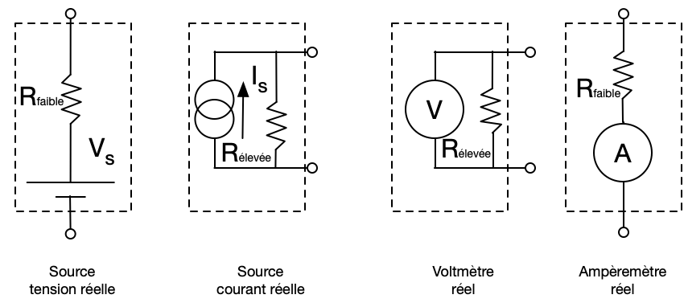

# Les bases de l'électronique

On ne s'en sort pas: la connaissance de l'électronique est essentielle pour accomplir les moindre tâches en optique: photodétection, numérisation, contrôle d'appareils, interface microprocesseur, gestion USB, etc... Il y a deux façons d'aborder ce domaine: 1) en devenant opérationnel[^1] ou 2) en comprenant[^1]. S'il y avait un seul conseil que je donnerais: les circuits, aussi complexes soient-ils, se séparent toujours en petits blocs fonctionnels. Savoir reconnaître les blocs représente 90% de la bataille.  J'espère avec ce document faire le premier et possiblement le deuxième.

En terminant:

1. Briser un fil, brûler une résistance, écraser un condensateur, brancher un transistor à l'envers, péter un chip à 10$ fait partie de l'apprentissage. Ce n'est pas grave: c'est quelques dollars. Voir 2.
2. Brancher 100V dans un oscilloscope de 3000$ et le péter, mettre ses mains ou sa langue sur 1200V et finir à l'hôpital, brûler une puce à 200\$ qui a un temps de livraison de 8 semaines, faire sauter le microntrolleur d'un laser commercial, fait partie de la liste des choses qui font que les gens se font mettre dehors.  Apprenez la différence avec 1.

La meilleure façon d'apprendre l'électronique, c'est d'en faire, c'est comme la musique :

> “When I think about kids watching a TV show like American Idol or The Voice, then they think, ‘Oh, OK, that’s how you become a musician, you stand in line for eight fucking hours with 800 people at a convention center and… then you sing your heart out for someone and then they tell you it’s not fuckin’ good enough.’ Can you imagine?” he implores. “It’s destroying the next generation of musicians! Musicians should go to a yard sale and buy and old fucking drum set and get in their garage and just suck. And get their friends to come in and they’ll suck, too. And then they’ll fucking start playing and they’ll have the best time they’ve ever had in their lives and then all of a sudden they’ll become Nirvana. Because that’s exactly what happened with Nirvana. Just a bunch of guys that had some shitty old instruments and they got together and started playing some noisy-ass shit, and they became the biggest band in the world. That can happen again! You don’t need a fucking computer or the internet or The Voice or American Idol.” - Dave Grohl

## Vraiment: les bases

1. Une source de tension idéale donne une différence de potentiel constante entre ses bornes, quelle que soit la résistance connectée entre ses bornes.
2. Une source de courant idéale donne un courant constant quelle que soit la résistance connectée entre ses bornes.
3. Un voltmètre idéal a une résistance "infinie" et mesure la différence de potentiel entre ses bornes sans prendre de courant.
4. Un ampèremètre idéal a une résistance nulle et mesure le courant qui passe entre ses bornes sans perte de potentiel.

## Être opérationnel

### Commentaires généraux

1. La perte de tension à travers une résistance est donnée par $V = RI$
2. La puissance dissipée par un élément est $P = VI $
3. **On mesure des tensions, en Volts**. La raison pourquoi on travaille en tension plutôt qu'en courant est qu'une mesure en parallèle d'une tension n'affecte pas le système et est égale à la mesure qui nous intéresse. Si on mesurait des courants, on devrait faire un calcul pour obtenir le courant du système à partir de notre mesure (car les courants se séparent selon les résistances) et si on le mesurait en série on devrait s'inclure dans le système.  Les deux options ne sont pas pratique.
   1. Un capteur qui retourne un courant devra être adapté pour s'intégrer au reste de notre circuit
4. Les résistances, capacitances et inductance sont regroupés sous le terme général *impédance*, qui est une résistance complexe.
5. Une source de tension idéale a une impédance de sortie faible.
6. Une source de courant idéale a une impédance de sortie élevée.
7. On veut souvent qu'un appareil ait une impédance d'entrée de 50 Ω (s'il accepte du courant) ou élevé par exemple 1MΩ (s'il doit être en parallèle sans affecter le circuit).
8. Finalement, on décrira souvent les courants et les tensions en termes de fréquences d'oscillation.  On parle de DC pour les fréquences 0 Hz et AC pour les autres.
   1. Ne pas confondre $f$ et $\omega = 2\pi f$.  

### Règles du pouce

- **Résistance**
  1. Une résistance moyenne est de 10 kΩ.
  2. Une petite résistance résiduelle est de l'ordre de 1 Ω ou moins
  3. Une grande résistance d'entrée est de l'ordre de 1 à 10 MΩ.
  4. L'impédance d'une résistance est de $R$
- **Capacitance**
1. Une capacitance moyenne est environ 1 µF
  2. Une capacitance ne laisse pas passer le courant continu. Son impédance diminue avec l'augmentation de la fréquence d'oscillation du courant ou de la tension.
  3. L'impédance d'une capacitance est $\frac{1}{j 2\pi f C}$.
  4. Les capacitances résiduelles de connecteurs sont de l'ordre de quelques pF.
  5. Un câble "standard" a une capacitance de 30 pF/m
- **Inductance**
  1. On travaille très peu avec les inductances
  2. Une inductance s'oppose au courant qui varie vite, et pas du tout au courant qui n'oscille pas. Son impédance augmente avec l'augmentation de la fréquence d'oscillation du courant ou de la tension.
  3. L'impédance d'une inductance est $j 2 \pi f L$
- **Tension**

  1. Une tension moyenne dans un circuit simple est entre de l'ordre du Volt.
  2. Une tension d'alimentation dans un circuit est typiquement ±12V ou ±15V
  3. Un circuit logique TTL fonctionne avec 0 V et 5 V comme signaux.
  4. Mesurer 1 Volt est facile.  Mesure 1 mV est difficile. Mesure 10 V est très facile.
  5. Un bruit typique dans un circuit est de l'ordre du 1 mV.
- **Courant**

  1. Un courant moyen est de l'ordre de 10 à 100 µA
  2. Un très petit courant est en pA.
  3. Un courant très important est 1A
- **Batterie**
  1. Une batterie de maison AA contient 2000 mA-h (milli-ampère $\times$ heure).
- **Filtres**
  1. Un filtre RC a un temps caractéristique de $\tau = RC$ en  secondes

## Équipement

| Description       |                          Apparence                           |
| ----------------- | :----------------------------------------------------------: |
| Multimètre        |  |
| Câbles BNC        |  |
| Prises alligators |  |
| Prises bananes    |  |

##Les imperfections

## Les équivalences

Équivalent de Norton:

$R_\text{Th} = R_\text{No}$

$V_\text{Th} = I_\text{No} R_\text{No}$

$I_\text{No} = \frac{V_\text{Th}}{R_\text{Th}}$

### Blocs fonctionnels à décrire

1. Voltage divider
2. RC HP, LP
3. Op-amp follower/buffer
4. Op-amp gain
5. Op-amp transimpedance
6. Op-amp adder
7. Numeriseur
8. Instrumentaiton amplifier
9. https://artofelectronics.net

### Commentaires photodétection

1. Les photodétecteurs produisent des courants de 0.5A/W.

[^1]: J'étais nul en électronique au bacc. Nul. Zéro.  J'ai eu un déclic dans le cours Physique Expérimentale III en 1994 avec [Normand Balaux](https://www.coopfuneraire2rives.com/avis-de-deces/normand-balaux-147920/#ecrire) (que j'aimais beaucoup même s'il était extrêmement discret).  Par la suite, un stage d'été à Toronto en compagnie de l'excellent étudiant [Gary Allan](https://www.linkedin.com/in/gary-allan-6250a210/) m'a convaincu de l'importance d'apprendre l'électronique au moins pour être opérationnel au laboratoire. Pour graduer, j'ai dû faire beaucoup d'électronique, réparer des choses, en construire des nouvelles, automatiser mes montages, etc... À force d'en faire, les automatismes de laboratoire se sont transformés en connaissances.

