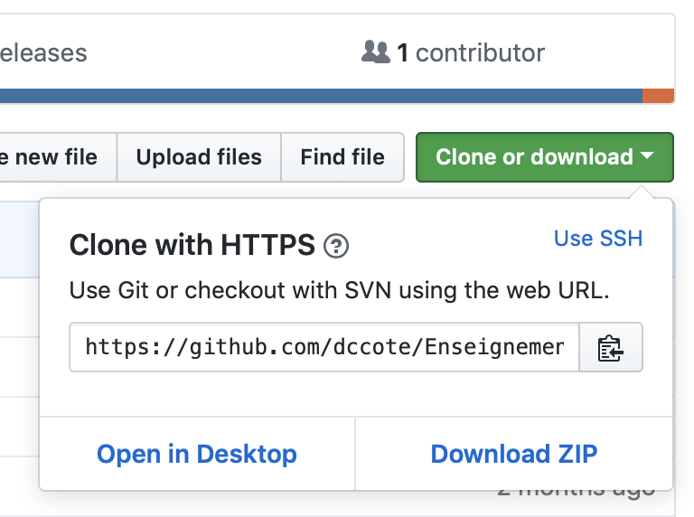
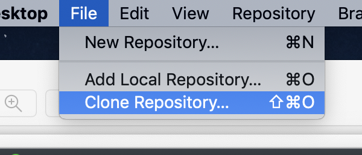
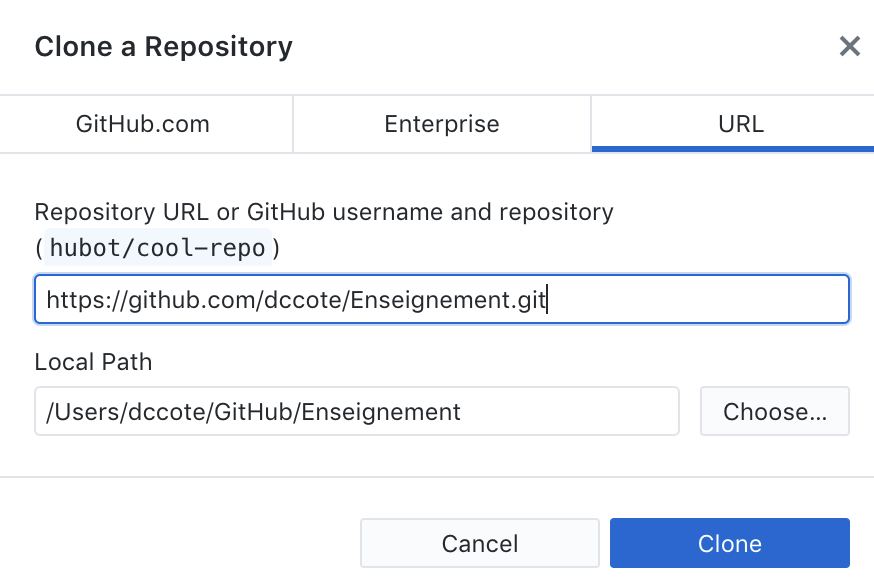
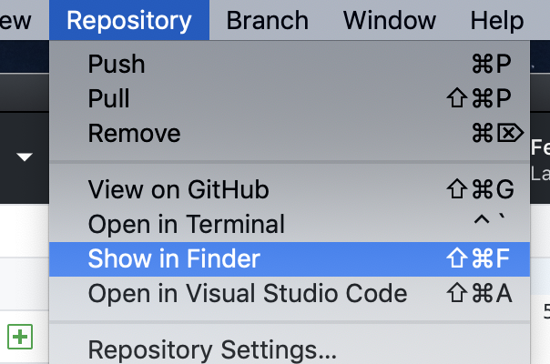
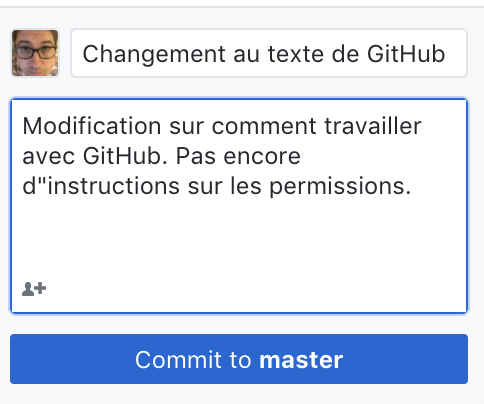
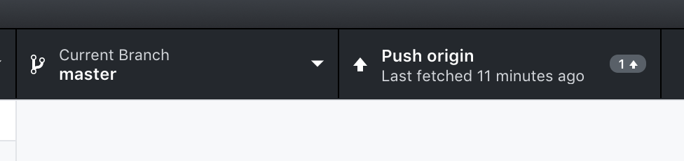

[TOC]

*English version at the bottom*

*Toute aide pour améliorer ce document est le bienvenue.*

# Francais

## Les systèmes de version

Le *versioning* est une méthode de travail qui s'exécute à l'aide *d'outils de versioning*. Grâce à ces outils:

1. Plusieurs personnes peuvent travailler sur les mêmes documents en même temps,
2. Un historique des modifications est conservé et permet de retourner l'état des fichiers à un moment particulier,
3. Un système de gestion des modifications est disponible

Il existe plusieurs outils de versioning: `cvs`, ` subversion`,  `perforce`,  `git`. [Pour plusieurs raisons](https://news.ycombinator.com/item?id=17483083), `git` est devenu le standard. Pour faciliter la collaboration, des site web (GitHub, GitLab, GitBucket, etc...) mettent en place un serveur git où les gens peuvent s'inscrire pour conserver le code source.  GitHub est particulièrement bien fait et [est gratuit pour le monde académique](https://help.github.com/articles/applying-for-an-academic-research-discount/). C'est donc le choix qui s'impose aujourd'hui et c'est ce qui sera discuté.

### 1-2-3 Comment ça marche, le *versioning*?

Voici un exemple de journée de travail fait avec un logiciel de versioning dans sa version la plus simplifié:

1. J'ouvre mes outils pour travailler.

2. J'obtiens (*pull*) le code le plus récent de mon projet sur le répertoire (*repository*) du serveur.

3. Je travaille, en plusieurs petites tâches:

   1. À chaque fois que je termine une petite tâche, je commets (*commit*) mon code, c'est-à-dire j'écris l'équivalent d'un cahier de labo:

   > "J'ai complété la tâche 1 qui consistait à ... et les fichiers modifiés sont les suivants."

   3. Je retourne (*push*) l'ensemble de mes modifications dans le répertoire du serveur

4. Si des collègues modifient le code, je demande (*pull*) au serveur les modifications les plus récentes.  Elles seront intégrées (*merged*)  normalement dans mon code sans que je ne fasse rien de particulier, à moins que deux personnes aient modifié exactement les mêmes lignes de code.

5. Lorsque j'ai terminé, tout le monde sur le même projet a accès aux modifications que j'ai fait.

## GitHub

### Je veux travailler sur le code de *xyz*, qu'est-ce que je fais?

1. Je trouve le code voulu sur GitHub et l'URL pour cloner:

   

2. Dans l'application [GitHub](https://desktop.github.com), je clone: 
   

3. Je copie l'URL voulu et je clique **Clone**:
   

4. Je peux demander a GitHub de m'ouvrir le répertoire sur mon ordinateur une fois que la copie est terminée:
   

5. Je commence à travailler en créant une branche ou en prenant un branche existante.
   
6. Je travaille avec les logiciels appropriés. J'édite les fichiers. Lorsque j'ai terminé, je **Commit** mes changements:

   

7. Si j'ai la permission sur ce **Repository**, je peux envoyer mes modifications (**Push**).

   

8. Je demande un Pull Request pour que quelqu'un revise mon code.  Si personne n'est associé à ce projet, je merge mon code moi-même mais j'utilise Pull request quand même pour retracer les actions.

### S'inscrire

1. S'inscrire pour obtenir un compte sur [GitHub.com](https://github.com/join?source=experiment-header-dropdowns-home)
2. Se brancher sur github.com

# English

*Help in improving this document is welcome.*

## Versioning systems

Versioning* is a working method that is executed using *versioning* tools. Thanks to these tools:

1. Several people can work on the same documents at the same time,
2. A history of changes is kept and makes it possible to return the state of the files at a particular time,
3. A change management system is available

There are several versioning tools: `cvs`, `subversion`, `perforce`, `git`. For several reasons](https://news.ycombinator.com/item?id=17483083), `git` has become the standard. To facilitate collaboration, websites (GitHub, GitLab, GitBucket, etc...) set up a git server where people can sign up to keep the source code.  GitHub is particularly well done and [is free for the academic world](https://help.github.com/articles/applying-for-an-academic-research-discount/). So this is the choice we have to make today and that's what will be discussed.

### 1-2-3 How does *versioning* work?

Here is an example of a working day done with a versioning software in its simplest version:

1. I open my tools to work.

2. I get (*pull*) the most recent code of my project on the server's *repository* directory.

3. I work, in several small tasks:

   1. Each time I finish a small task, I commit my code, i.e. I write the equivalent of a lab notebook:

   > "I have completed Task 1, which consisted of... and the modified files are as follows."

   3. 3. I return (*push*) all my modifications in the server's directory

4. If colleagues change the code, I ask (*pull*) the server for the most recent changes.  They will be (*merged*) normally integrated into my code without me doing anything special, unless two people have changed exactly the same lines of code.

5. When I'm done, everyone on the same project has access to the changes I've made.

## GitHub

### I want to work on the code for *xyz*, what do I do?

1. I find the code on GitHub and the URL to clone:

   

2. In the [GitHub](https://desktop.github.com) application, I clone: 
   

3. I copy the desired URL and click **Clone**:
   

4. I can ask GitHub to open the directory on my computer once the copy is complete:
   [image-20181203191022532](assets/image-20181203191022532.png)

5. I start work by creating a branch or taking an existing branch.
   
6. I work with the appropriate software. I edit the files. When I'm done, I **commit** my changes:

   

7. If I have permission on this **Repository**, I can send my changes (**Push**).

   

8. I'm requesting a Pull Request for someone to review my code.  If no one is associated with this project, I mess up my code myself but I use Pull request anyway to track the actions.

### Sign up

1. Sign up for an account on [GitHub.com](https://github.com/join?source=experiment-header-dropdowns-home)
2. Login to github.com

