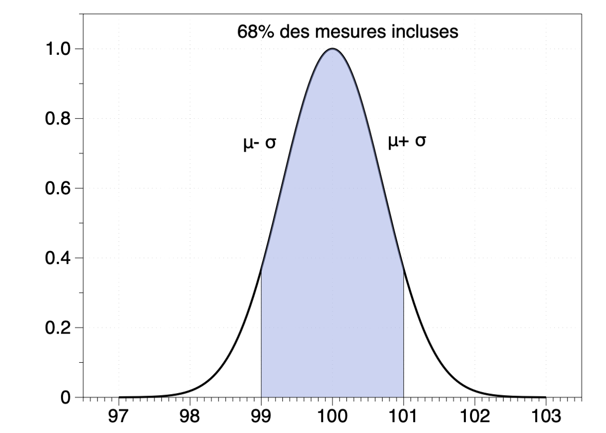
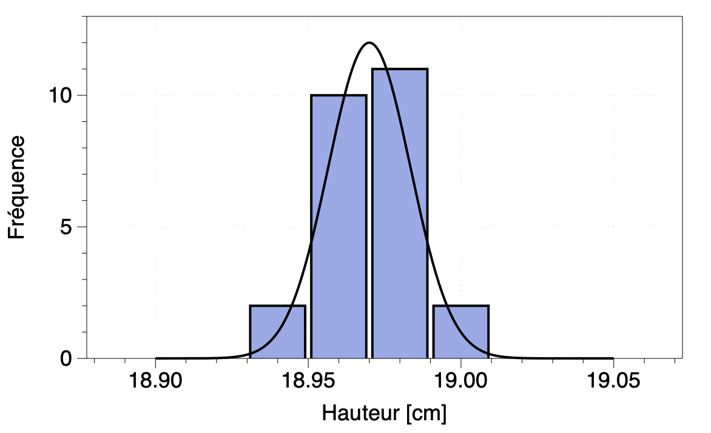

# Incertitudes, Exactitude et test d'hypothèses

## Règles générales dans la vie de tous les jours

1. Nous supposons presque toujours que les erreurs sont normalement distribuées: les distributions sont donc normales, gaussiennes.
2. Les incertitudes sur les sommes et soustractions peuvent rapidement etre obtenue en additionnant les erreurs absolues de chacune: $(a\pm\Delta a) + (b \pm \Delta b) = a+b \pm (\Delta a + \Delta b)$
3. Les incertitudes sur les produits et quotients peuvent rapidement etre obtenue en additionnant les erreurs relatives de chacune: $(a \pm \Delta a) \times (b \pm \Delta b) = ab \pm (\Delta a / a + \Delta b/b)$
4. On prend souvent "la moitié de la plus petite division" d'un appareil parce que ça va vite et c'est raisonnable.
5. On peut prendre un grand nombre de mesures pour obtenir la distribution de facon plus précise
6. Les incertitudes des mesures ne sont pas toujours pertinentes dans une expérience

## Signification de a ± ∆a

Lorsqu'une mesure de $a ± \Delta a$ est donnée, on veut dire "qu'un grand nombre de mesures *dans les mêmes conditions* donnera une distribution gausienne centrée sur $\mu = a$ et de largeur $\sigma = \Delta a$. Une mesure de 100 ± 1 est illustrée ci-contre:

## Exemple: Règle à mesurer

Une règle à mesurer à une division de 1 mm est utilisée pour mesurer la hauteur d'un livre rectangulaire (N=25 mesures) à différents endroits. La distribution est obtenue ci-dessous.  

[18.95, 19.00, 18.95, 18.98, 18.98, 18.98, 19.00, 18.93, 18.98, 18.99, 18.98, 18.95, 18.98, 18.95, 18.98, 18.95, 18.95, 18.96 ,18.99, 18.94, 18.96, 18.98, 18.95, 18.99, 18.95]

Moyenne: 18.698, Écart-type: 0.019 

Nous concluons:

1. La moitié de la plus petite division de la règle est 0.05 mm. On peut la prendre comme approximation rapide de la précision d'une mesure.
2. La distribution, qui englobe l'ensemble du processus (le livre, la position où la mesure a été prise, l'angle, la règle, la parallaxe, etc...), possède une largeur de 0.02 cm.  On peut la prendre comme une meilleure valeur de la précision de la mesure obtenue par statistiques (mais c'est plus long).
3. Immédiatement après la première mesure, on dirait que la hauteur du livre est 18.95 ± 0.05 cm. C'est la seule mesure que l'on a. L'incertitude la plus raisonnable est la moitié de la plus petite division.
4. Après 25 mesures, les mesures sont distribuées autour de 18.97 ± 0.02.
5. La connaissance de la moyenne est maintenant 18.968 ± 0.004 car l'erreur sur la moyenne après $N$ mesures est $\sigma/\sqrt{N}$. 
   1. Cette moyenne est pertinente si les mesures sont faites dans des conditions identiques et que la hauteur du livre est vraiment la même dans toutes ces conditions. Ceci peut être discutable.
   2. Dans notre cas, la connaissance de la hauteur moyenne pourrait être pertinente pour calculer l'aire de la couverture (en supposant un rectangle)

