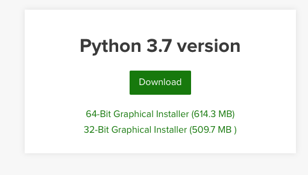

# Comment installer Python 3 sur son ordinateur personnel?

Une version de Python récente (>3.7) est souvent demandée pour faire de l'analyse de données ou des calculs. La solution la plus simple est d'utiliser [Anaconda](https://www.anaconda.com/distribution/#download-section) et d'installer directement avec l'Installeur Graphique.

À la fin de l'installation, le Python d'Anaconda devrait être priorisé par rapport au Python de votre système (s'il est présent) pour votre compte personnel.

*Note*: macOS vient avec Python, mais il s'agit d'une vieille version (2.7).  Vous devez installer une version 3, ce qui peut se faire sans interférer avec la version du système. Suivez les instructions d'[Anaconda](https://www.anaconda.com/distribution/#download-section).

